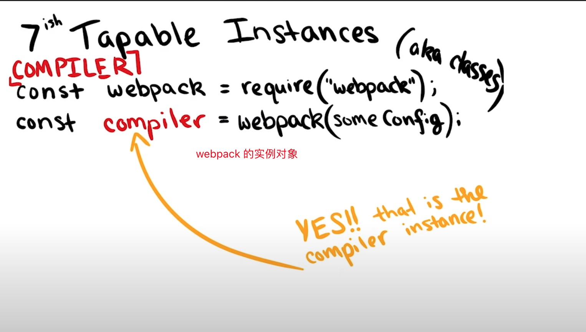
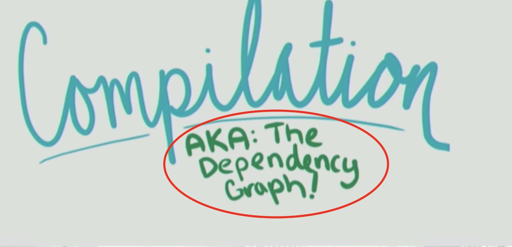
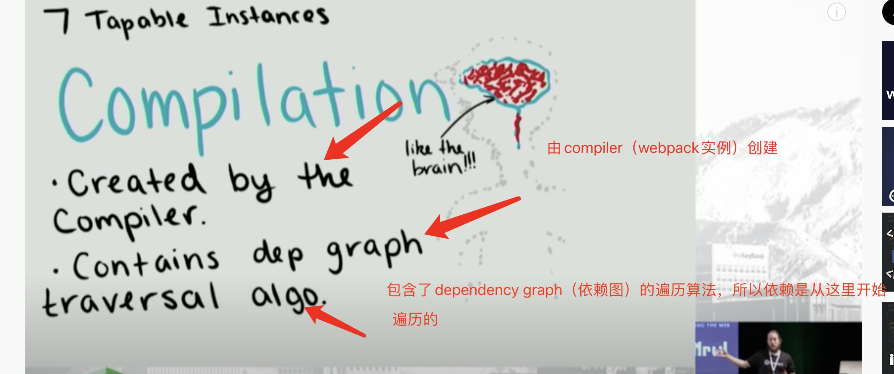
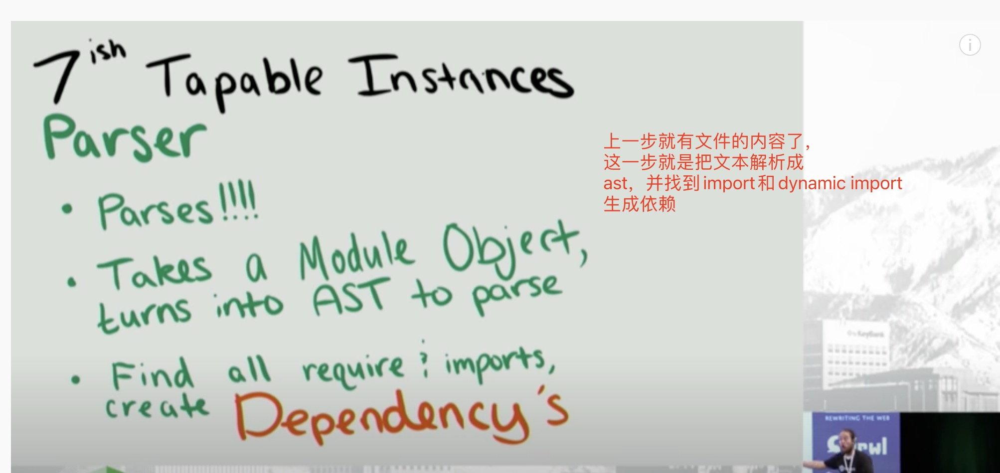
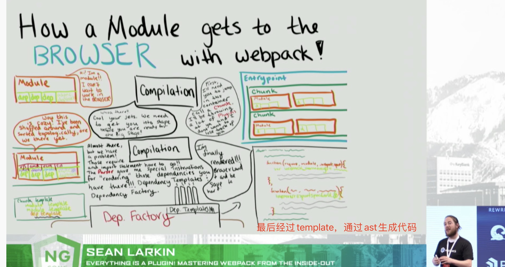

## webpack

>### compiler
 * compiler是webpack在构建过程中唯一的**实例对象**，包含了当前环境的所有配置信息，包括loader，options和plugin

 >### compilation
* compilation 又名webpack的 依赖图(dep graph)。由compiler（webpack的实例）创建。
* compilation中又包含了遍历依赖图的算法，所以依赖是从这里开始便利的

>## Module Factories
* 拿到resolve好的requests（也就是compilation遍历到单个依赖，然后resolve进行解析得到的文件）然后去这个文件里取到想要的信息

>## parser
* 经过上一步的过程获取到了文件的内容，然后通过parser把文件的内容进行解析成ast，并找到import跟dynamic import进行生成依赖

>## tempalate
* 最后经过template，通过ast生成代码

>## tabable
* tabable可以理解为一个事件分发系统（订阅发布），然后在call的时候一个个进行触发（通过new Function去执行）
